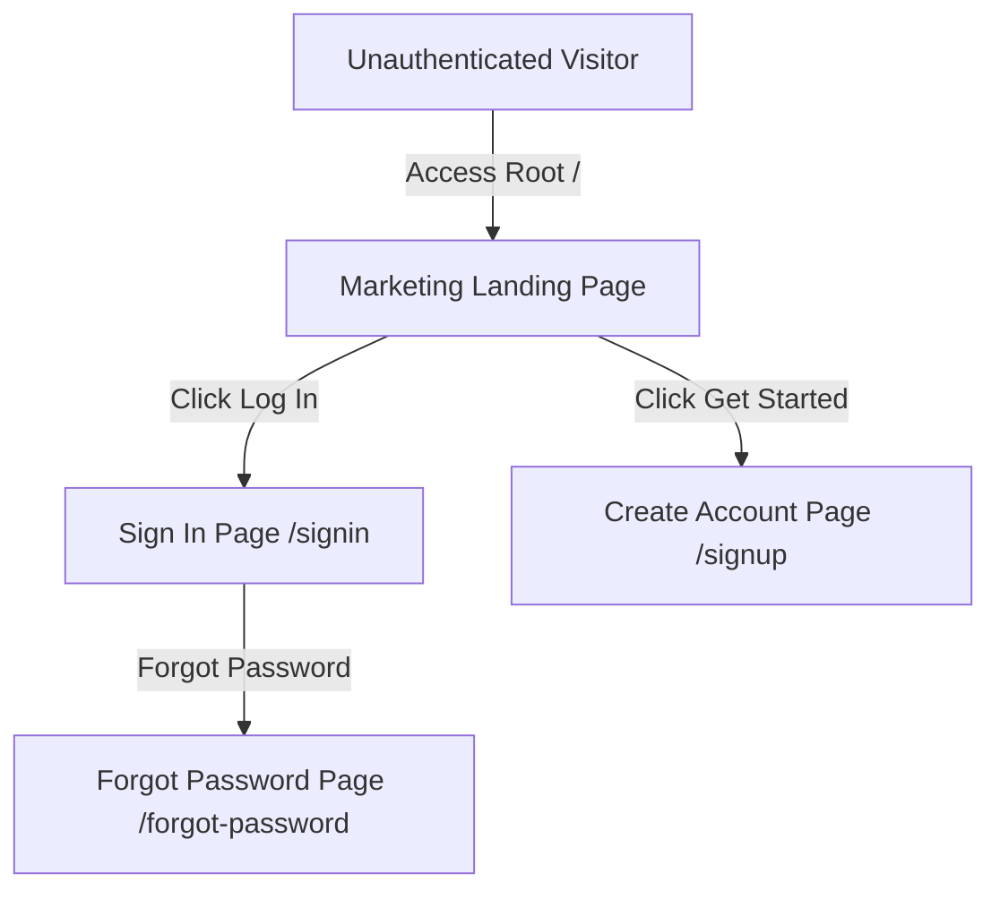
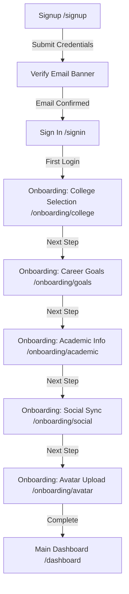

# Momentum - Frontend User Navigation Flow

This document details the user journey, access entry points, authentication, onboarding, and core productivity loops in **Momentum**.

---

## 1. Entry & Landing Phase

* **Entry Point**: The user lands on the **Marketing Landing Page** (`/`). They can review platform capabilities and streaks.
* **Access Paths**: From there, they can click "Sign In" (`/signin`) or "Get Started" (`/signup`).

---

## 2. Authentication & Onboarding Loop

* **Email Verification**: Following `/signup`, the user is prompted to verify their email before they can authenticate at `/signin`.
* **Onboarding Gate**: On their very first login, a route-guard checks if the profile is incomplete and redirects the user into the `/onboarding/*` flow. Users cannot skip this gate to access the dashboard.

---

## 3. Core Productivity Loops

### A. Focus & Study Loop
* **Standard Entry**: User accesses the **Dashboard** (`/dashboard`) or clicks **Focus** in the sidebar to open the **Focus Dashboard** (`/dashboard` / `/focus` portal).
* **Private Study Flow**:
  1. User selects a task, configured categories (e.g. Quantum Physics II), and clicks **Start Session**.
  2. The page transitions into the fullscreen, distraction-free **Active Focus Mode** (`/focus`).
  3. During active sessions, they can toggle breaks (Studying <=> Break) or hit **End Session** to save statistics.
  4. Upon ending, their metrics sync with the backend, incrementing their weekly hours and updating streak statuses.
* **Collaborative Study Flow**:
  1. User navigates to **Study Rooms** or selects a room from their groups.
  2. They enter a **Collaborative Study Room** (`/groups/room/:id`).
  3. The timer runs synchronized with other room peers. A live activity ticker on the side shows peers joining, starting work, or taking breaks.

### B. Goals & Challenges Loop
* **Goal Setting**:
  1. User opens the **Goals** dashboard (`/challenges` or `/profile`).
  2. They set target goals (e.g. "Solve 128 Leetcode Problems").
  3. Progress is tracked via sliders or tick-boxes which increment dynamically and update their consistency score.
* **Community Challenges**:
  1. User views active group challenges.
  2. Click **Join Challenge** to participate in community sprints (e.g., "7-Day Github Streak Sprint").
  3. Daily actions trigger automated GitHub synchronizations via background workers.

### C. Study Groups & Collaboration Loop
* **Join Flow**:
  1. User views **Groups Board** (`/groups`) and browses recommendations.
  2. Click **Join Group** on a public group, or request access for private rooms.
* **Management Flow**:
  1. Group admins access `/groups/:id/settings` to approve pending join requests, kick inactive members, or configure room schedules.
  2. Group members join the shared study room (`/groups/room/:id`) or set collaborative targets.
